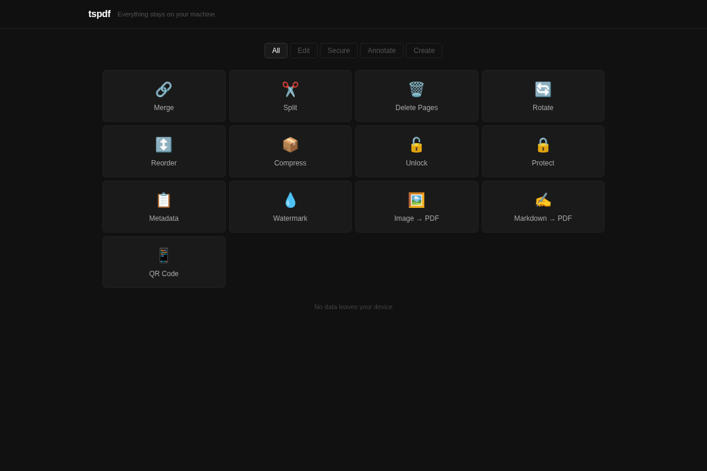

# tspdf

Every PDF tool wants your files. This one doesn't.

tspdf is a local-first PDF toolkit. Merge, split, encrypt, watermark, compress, and more — all on your machine. No uploads, no cloud, no tracking. Just a single binary you build from source.



## Web UI

```bash
tspdf serve
```

Opens a local web interface at http://localhost:8080 for all PDF operations. The UI is embedded in the binary — no extra files, no internet connection needed. Your documents never leave your computer.

```bash
tspdf serve --port 3000   # custom port
```

## Command Line

```bash
tspdf merge a.pdf b.pdf -o combined.pdf
tspdf split report.pdf --pages 1-5 -o extract.pdf
tspdf encrypt doc.pdf -o locked.pdf --password secret
tspdf decrypt locked.pdf -o unlocked.pdf --password secret
tspdf rotate doc.pdf --angle 90 -o rotated.pdf
tspdf watermark doc.pdf -o draft.pdf --text "DRAFT"
tspdf compress doc.pdf -o smaller.pdf
tspdf metadata doc.pdf
tspdf md2pdf notes.md -o notes.pdf
tspdf img2pdf photo.jpg -o photo.pdf
tspdf qrcode "https://example.com" -o qr.pdf
```

Run `tspdf help <command>` for details.

## Install

Requires a C compiler and `make`. Nothing else.

```bash
git clone https://github.com/be-lang/tspdf
cd tspdf
make
```

Install to your PATH:

```bash
make install PREFIX=~/.local        # user-local
sudo make install                   # system-wide (/usr/local)
```

Uninstall with `make uninstall PREFIX=~/.local` or `sudo make uninstall`.

## Why tspdf?

Most PDF tools are either cloud services that require uploading your documents, or desktop apps bundled with hundreds of megabytes of dependencies. tspdf is different:

- **Fully local** — your files stay on your machine, always
- **Zero dependencies** — pure C with no external libraries, not even zlib
- **Single binary** — one tool for reading, writing, merging, encrypting, and generating PDFs
- **Cross-platform CLI** — developed on Linux; also builds on macOS and Windows with a C11 toolchain
- **~28K lines of C11** (sources and headers) — auditable and fast

Everything is implemented from scratch: deflate compression, PNG decoding, AES encryption, TrueType font parsing, and a flexbox-style layout engine.

## Use as a C Library

tspdf is also a C library for reading, manipulating, and generating PDFs programmatically.

### Generate a PDF

```c
#include "include/tspdf.h"

static double measure_cb(const char *font, double size, const char *text, void *ud) {
    return tspdf_writer_measure_text((TspdfWriter *)ud, font, size, text);
}

int main(void) {
    TspdfWriter *doc = tspdf_writer_create();
    const char *font = tspdf_writer_add_builtin_font(doc, "Helvetica");

    TspdfArena arena = tspdf_arena_create(1024 * 1024);
    TspdfLayout ctx = tspdf_layout_create(&arena);
    ctx.measure_text = measure_cb;
    ctx.measure_userdata = doc;
    ctx.doc = doc;

    TspdfNode *root = tspdf_layout_box(&ctx);
    root->width = tspdf_size_fixed(595);
    root->height = tspdf_size_fixed(842);
    root->direction = TSPDF_DIR_COLUMN;
    root->padding = tspdf_padding_all(40);
    root->gap = 10;

    TspdfNode *title = tspdf_layout_text(&ctx, "Hello, PDF!", font, 24);
    tspdf_layout_add_child(root, title);

    TspdfStream *page = tspdf_writer_add_page(doc);
    tspdf_layout_compute(&ctx, root, 595, 842);
    tspdf_layout_render(&ctx, root, page);

    tspdf_writer_save(doc, "hello.pdf");
    tspdf_writer_destroy(doc);
    tspdf_arena_destroy(&arena);
}
```

```bash
# Portable: expand sources explicitly (shell globs like src/**/*.c are not portable).
gcc -o hello hello.c $(find src -name '*.c' -print | tr '\n' ' ') -lm && ./hello
```

### Manipulate existing PDFs

```c
#include "include/tspdf.h"

TspdfError err;
TspdfReader *doc = tspdf_reader_open_file("input.pdf", &err);

// Extract pages
size_t pages[] = {0, 1, 2};
TspdfReader *extract = tspdf_reader_extract(doc, pages, 3, &err);
tspdf_reader_save(extract, "pages_1_3.pdf");

// Merge
TspdfReader *docs[] = {doc1, doc2};
TspdfReader *merged = tspdf_reader_merge(docs, 2, &err);
tspdf_reader_save(merged, "merged.pdf");

// Encrypt with AES-256
tspdf_reader_save_encrypted(doc, "locked.pdf", "password", "owner", 0, 256);
```

## Full Feature List

**Reading and manipulation** — open existing PDFs, extract/delete/rotate/reorder/merge pages, add text watermarks, annotations (links, text notes, stamps), page numbers, content overlay, AES-128/256 encryption and decryption.

**Generation** — flexbox-style layout engine with fixed, grow, fit-content, and percentage sizing. Automatic page breaks with repeating headers. Tables with auto-sized columns, colspan, alternating row colors.

**Text** — TrueType font parsing and embedding with automatic subsetting, full Unicode via CIDFont Type2 + Identity-H, word/character wrapping, alignment, decorations, inline rich text spans.

**Graphics** — rounded corners, borders, shadows, backgrounds, opacity, clipping, transforms, vector paths (move, line, cubic Bezier, arc), linear and radial gradients.

**Media** — JPEG pass-through, PNG decoding from scratch, QR code generation, Markdown to PDF conversion.

**Crypto** — AES-128/256, MD5, SHA-256, RC4 — all implemented from scratch.

**Compression** — deflate/inflate from scratch (RFC 1950/1951).

## Credits

Created by [Benjamin Lang](https://github.com/be-lang). Built in collaboration with [Claude Code](https://claude.ai/claude-code).

## License

MIT. See [LICENSE](LICENSE).
